# Laporan Workshop Administrasi dan Jaringan
## Docker dan Instalasi

 

  

 

| Disusun Oleh                     |            |
| -------------------------------- | ---------- |
| Rizal Maulana Airlangga          | 3124600033 |
| Muhammad Fajrul Fatih Abul 'Ilmi | 3124600040 |
| Nur Aini Agusthina               | 3124600050 |

| Kelas        | 2 S.Tr. Teknik Informatika B  |
| ------------ | ----------------------------- |
| **Kelompok** | **B4**                        |

 

### Dosen Pengampu
**Dr. Ferry Astika Saputra, S.T., M.Sc.**

 

## PROGRAM STUDI D4 TEKNIK INFORMATIKA
## DEPARTEMEN TEKNIK INFORMATIKA DAN KOMPUTER
## POLITEKNIK ELEKTRONIKA NEGERI SURABAYA
## 2026

  

# Pre-Lab
1. Sebutkan minimal 3 perbedaan antara Virtual Machine dan Container.
>  - Virtual Machine menjalankan guest OS lengkap, sedangkan container berbagi kernel host
>  - VM lebih berat dalam penggunaan resource, sedangkan container lebih ringan dan cepat
>  - Booting VM membutuhkan waktu lebih lama, sedangkan container dapat berjalan dalam hitungan detik.
>  - VM menggunakan hypervisor, sedangkan container menggunakan container runtime seperti containerd dan runc.

2.  Apa fungsi dari containerd dan runc dalam arsitektur Docker?
> containerd berfungsi sebagai container runtime tingkat tinggi yang mengelola lifecycle container seperti pull image, start, stop, dan networking. runc adalah low-level runtime yang bertugas membuat dan menjalankan container sesuai standar OCI.

3. Mengapa Docker membutuhkan kernel Linux? Bagaimana Docker Desktop di Windows mengatasi hal ini?
> Docker menggunakan fitur kernel Linux seperti namespaces dan cgroups untuk isolasi dan manajemen resource container. Di Windows, Docker Desktop menggunakan WSL2 atau virtual machine Linux kecil agar Docker tetap dapat menjalankan kernel Linux.

4. Apa keuntungan layered filesystem pada Docker Image?
> Layered filesystem memungkinkan reuse layer antar image sehingga lebih hemat storage, mempercepat build, dan mempercepat proses pull/push image.

5. Jelaskan perbedaan antara docker run dan docker exec.
> docker run digunakan untuk membuat dan menjalankan container baru dari image. docker exec digunakan untuk menjalankan perintah tambahan pada container yang sudah berjalan.

 

# Screenshot Wajib
## docker version: Versi Client dan Server
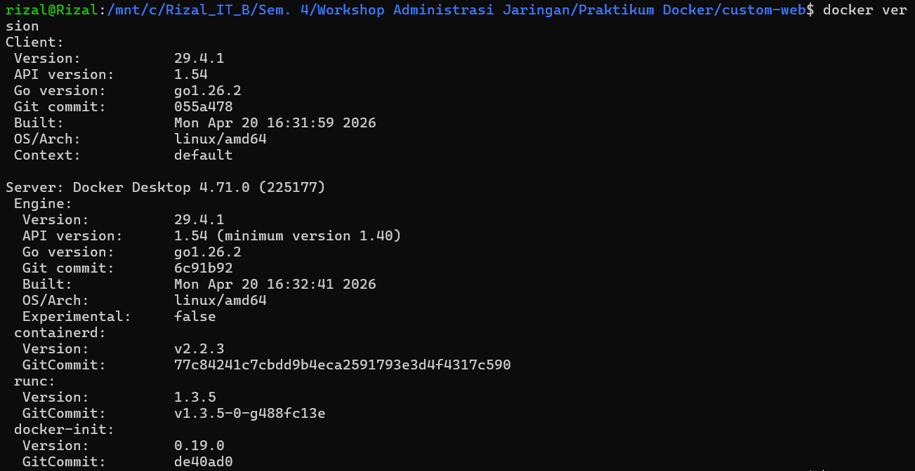

## sudo systemctl status docker: Service Active (Running)
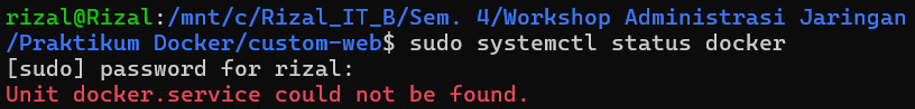

## docker run hello-world: Pesan Sukses Lengkap
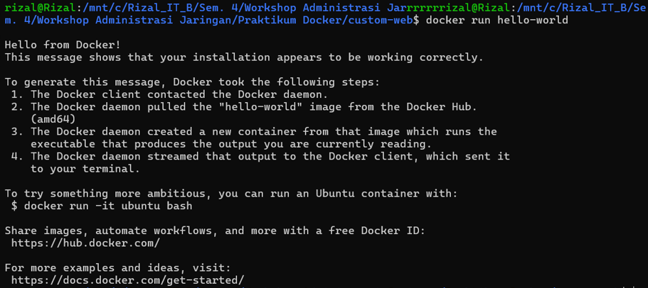

## docker images: Daftar Image yang Sudah di-pull
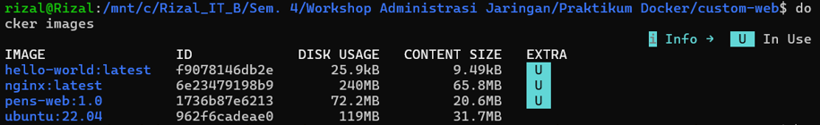

## docker ps: Container nginx Berjalan dengan Port Mapping
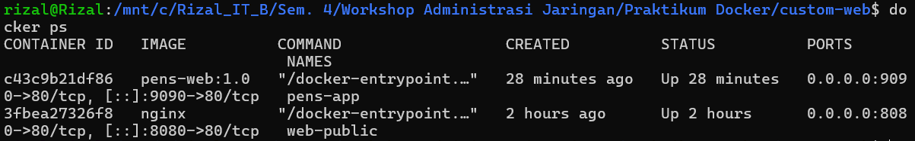

## Browser Mengakses http://localhost:8080: Halaman nginx Default
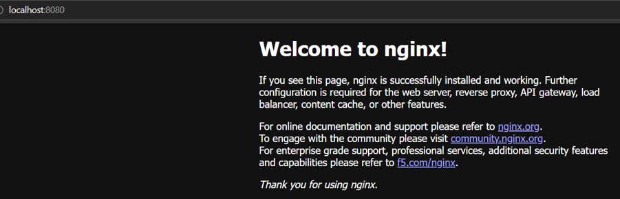

## docker build -t pens-web:1.0 .: Proses Build Berhasil (Step Terakhir)
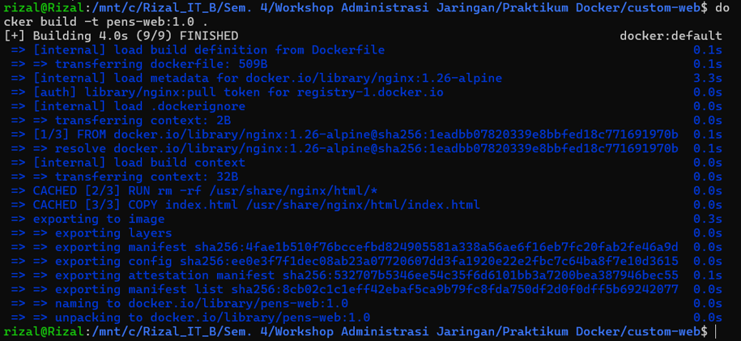

## Browser Mengakses http://localhost:9090: Halaman Custom PENS
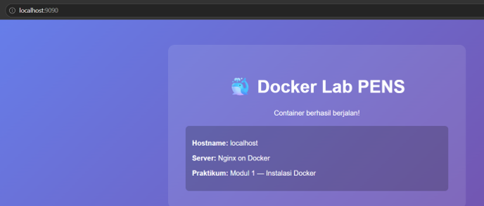

 

# Post-Lab
1. Bandingkan output docker image history nginx dengan docker image history pens-web:1.0. Layer mana saja yang di-share?
> - ENTRYPOINT ["/docker-entrypoint.sh"]
> - EXPOSE 80
> - STOPSIGNAL SIGQUIT
> - CMD ["nginx" "-g" "daemon off;"]
> - COPY docker-entrypoint.sh
> - COPY 10-listen-on-ipv6-by-default.sh
> - COPY 15-local-resolvers.envsh
> - COPY 20-envsubst-on-templates.sh
> - COPY 30-tune-worker-processes.sh

2. Apa yang terjadi pada data di dalam container setelah container dihapus dengan docker rm? Bagaimana solusinya?
> 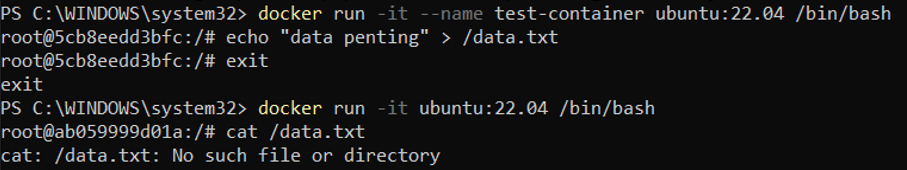
> - Seluruh data di dalam container akan hilang permanen.
> - Solusi yang bisa digunakan
>   - Data disimpan di Docker, terpisah dari container
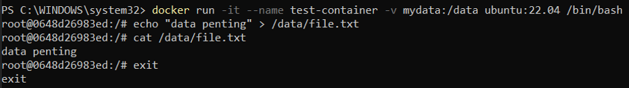
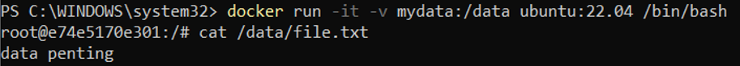
Data masih ada
>   - Data langsung disimpan di komputer

3. Jelaskan perbedaan antara EXPOSE di Dockerfile dan flag -p pada docker run. Apakah EXPOSE cukup untuk membuat port dapat diakses dari host?
> - EXPOSE (di Dockerfile)
>   - Deklarasi / dokumentasi bahwa container menggunakan port tertentu
>   - Memberi informasi ke user/tool (misalnya Docker Compose)
>   - Tidak membuka akses ke luar (host)
> - -p (saat docker run)
>   - Mapping port host ke container
>   - Membuka akses dari luar (browser, jaringan)
> - EXPOSE tidak cukup untuk membuat port dapat diakses dari host. Harus pakai -p
> - Percobaan
>   - docker run -d --name web1 nginx  
> 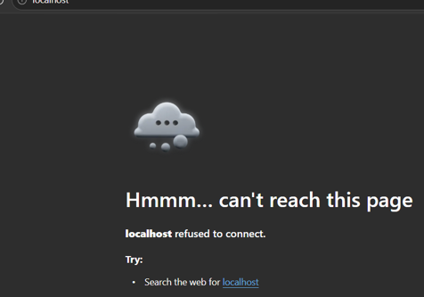  
>   - docker run -d --name web2 -p 8080:80 nginx
> 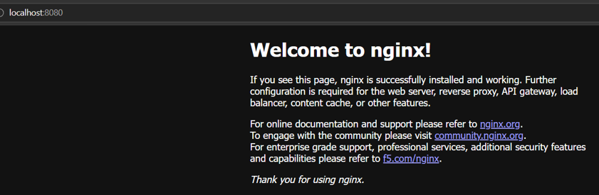  
> 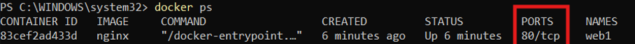  

4. Mengapa menggunakan tag spesifik (misal nginx:1.26) lebih baik daripada nginx:latest untuk production?
> - Reproducible
>   - nginx:1.26  versi tetap (Hari ini build, sukses)
>   - nginx:latest  bisa berubah kapan saja (Besok build (latest berubah) bisa error)
> - Stabilitas sistem
>   - Versi spesifik sudah teruji di environment
>   - latest bisa membawa perubahan (konfigurasi,dependency, dan breaking change)
> - Keamanan (security control)
>   - Versi spesifik dapat diketahui: CVE yang berlaku, patch yang dipakai
>   - Latest: tidak jelas berubah ke versi apa
> - Debugging lebih mudah
>   - Kalau error: nginx:1.26 bisa reproduce
>   - nginx:latest tidak konsisten

5. Berapa ukuran image alpine:3.20 dibanding ubuntu:22.04? Apa trade-off menggunakan Alpine?
> - Tabel perbandingan  
> 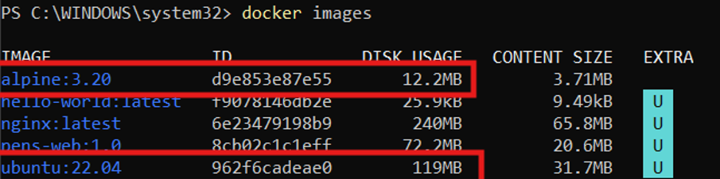  
> Alpine ≈ 10x lebih kecil dari Ubuntu  
> - Trade-off menggunakan Alpine
>   - Kelebihan Alpine
>     - Ukuran sangat kecil, pull cepat
>     - Startup container lebih cepat
>     - Surface attack lebih kecil (lebih aman)
>     - Hemat storage
>   - Kekurangan Alpine
>     - Menggunakan musl libc (bukan glibc)
>       - Beberapa aplikasi/library tidak kompatibel
>       - Contoh: Python packages tertentu, Java native libs
>     - Debugging lebih sulit
>       - Tools terbatas (tidak selengkap Ubuntu)
>       - Banyak package harus install manual
>     - Ecosystem lebih kecil
>       - Tidak semua software tersedia Kadang perlu workaround
>     - Build lebih kompleks
>       - Compile dependency bisa lebih ribet