# Laporan Workshop Administrasi dan Jaringan
## Docker Service Mount

 

  

 

| Disusun Oleh                     |            |
| -------------------------------- | ---------- |
| Rizal Maulana Airlangga          | 3124600033 |
| Muhammad Fajrul Fatih Abul 'Ilmi | 3124600040 |
| Nur Aini Agusthina               | 3124600050 |

| Kelas        | 2 S.Tr. Teknik Informatika B  |
| ------------ | ----------------------------- |
| **Kelompok** | **B4**                        |

 

### Dosen Pengampu
**Dr. Ferry Astika Saputra, S.T., M.Sc.**

 

## PROGRAM STUDI D4 TEKNIK INFORMATIKA
## DEPARTEMEN TEKNIK INFORMATIKA DAN KOMPUTER
## POLITEKNIK ELEKTRONIKA NEGERI SURABAYA
## 2026

  

# Pre-Lab
1. Apa perbedaan default bridge dan user-defined bridge network?
> Default bridge dibuat otomatis oleh Docker tetapi tidak mendukung DNS antar container. User-defined bridge dibuat manual dan mendukung komunikasi antar container menggunakan nama container.

2. Kapan menggunakan Volume vs Bind Mount vs tmpfs?
> Volume digunakan untuk data persisten production. Bind mount digunakan saat development agar file host langsung sinkron dengan container. tmpfs digunakan untuk data sementara di memory yang tidak perlu disimpan ke disk.

3. Apa yang terjadi pada named volume saat docker compose down? Bagaimana jika pakai flag -v?
> docker compose down tidak menghapus named volume sehingga data tetap ada. Jika menggunakan flag -v, maka volume ikut dihapus dan data hilang.

4.  Apa fungsi depends_on dan healthcheck di docker-compose.yml?
> depends_on mengatur urutan startup service. healthcheck digunakan untuk memeriksa apakah service benar-benar siap digunakan.

5. Mengapa user-defined bridge bisa DNS resolve nama container, sedangkan default bridge tidak?
> Karena user-defined bridge memiliki embedded DNS server Docker sehingga container dapat saling mengenali menggunakan nama container.

 

# Screenshot Wajib
## docker network ls
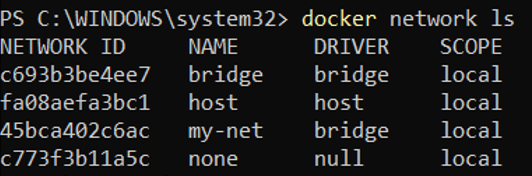

## ping antar Container by Nama
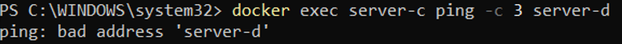  
Agar berhasil, buat network, lalu jalankan ulang container di network tersebut.
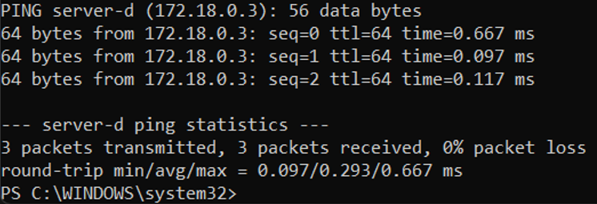

## docker volume ls + inspect
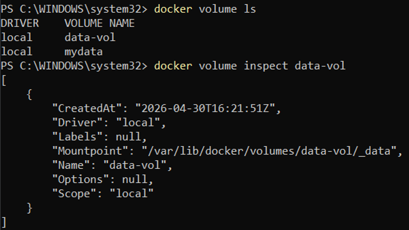

## Volume Sharing antar Container
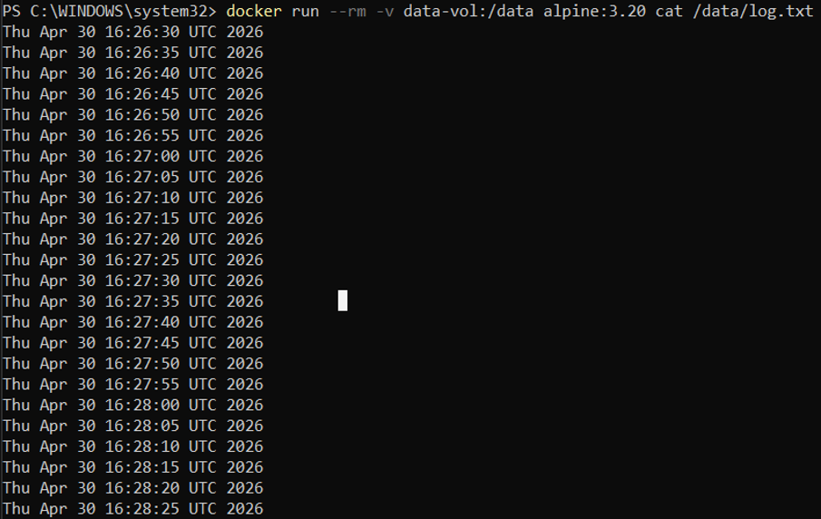

## Bind Mount Live-Reload (Sebelum atau Sesudah Edit)
- Sebelum edit  
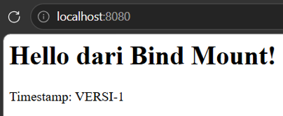
- Setelah edit  
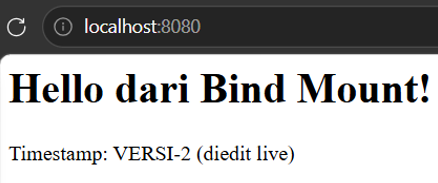

## tmpfs inspect
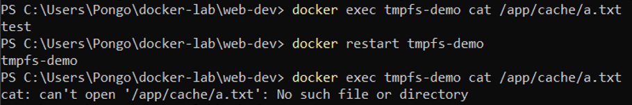

## docker compose ps
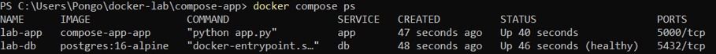

## Browser Halaman Web
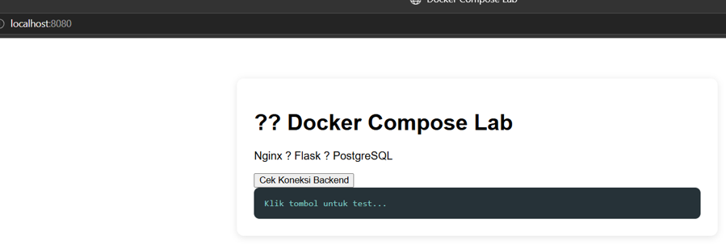

## curl /api/health Response
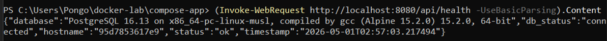

## docker compose down
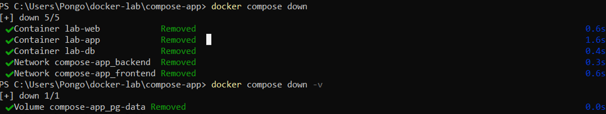

 

# Post-Lab
1. Jalankan docker network inspect lab-frontend. Sebutkan container dan IP masing-masing.
> 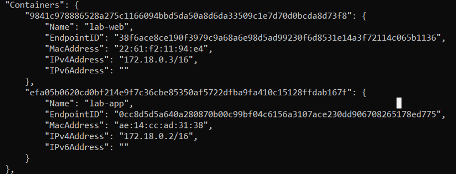
> - Container yang terhubung pada network compose-app_frontend adalah:
>   - lab-web = IP: 172.18.0.3/16
>   - lab-app = IP: 172.18.0.2/16
> - Container lab-db tidak termasuk karena hanya berada pada network compose-app_backend

2. Hapus container lab-app lalu docker compose up -d lagi. Apakah data PostgreSQL masih ada? Mengapa?
> 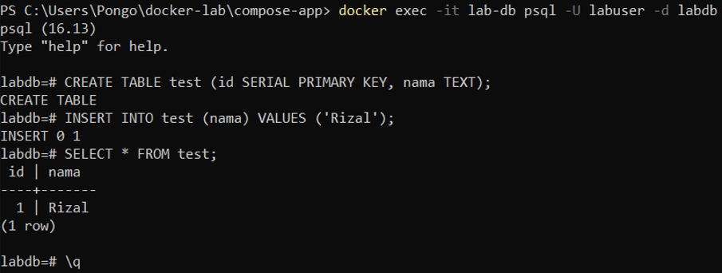
> 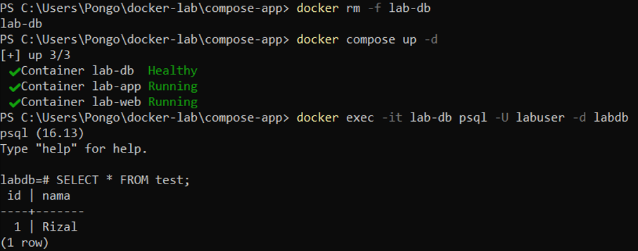
> - Data masih ada
> - Karena data database tidak disimpan di dalam container, melainkan pada Docker Volume (pg-data) yang didefinisikan pada docker-compose.yml. Sehingga data tidak ikut terhapus saat container dihapus dan masih bisa digunakan kembali saat container baru dibuat.

3. Tunjukkan perbedaan output docker inspect untuk mount type volume vs bind.
> 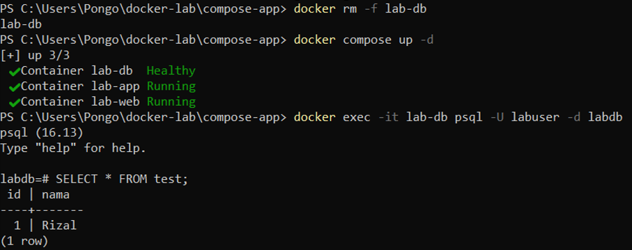  
> 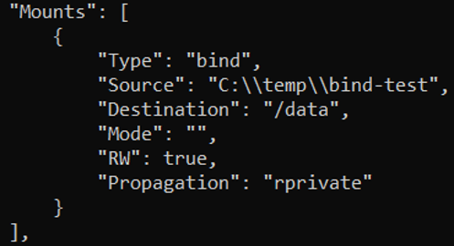

4. Jelaskan alur request dari browser → nginx → Flask → PostgreSQL.
> - Browser → Nginx
>   - User membuka: http://localhost:8080
>   - Request masuk ke container: lab-web (Nginx) dan Port mapping: 8080 → 80
> - Nginx → Flask (Reverse Proxy)
>   - Di nginx.conf:
> location /api/ { proxy_pass http://app:5000; }
>   - Artinya: request /api/... diteruskan ke http://app:5000
>   - app = nama container Flask (DNS Docker)
> - Flask → PostgreSQL
>   - Di app.py:  
> conn = psycopg2.connect( host="db", dbname="labdb", user="labuser", 
> password="labpass123" )
>   - Flask connect ke: db (container PostgreSQL)
>   - Query: SELECT version();
> - Response balik
>   - PostgreSQL → Flask → Nginx → Browser
>   - Output JSON:  
> { "status": "ok", "db_status": "connected" }
> 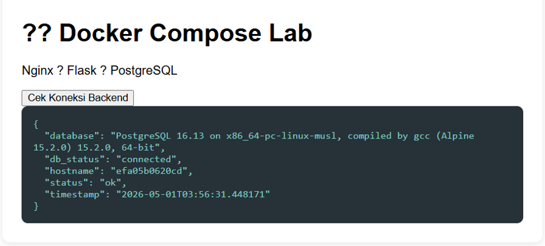

5. Bandingkan ukuran image yang digunakan stack ini. Mana terbesar dan mengapa?
> 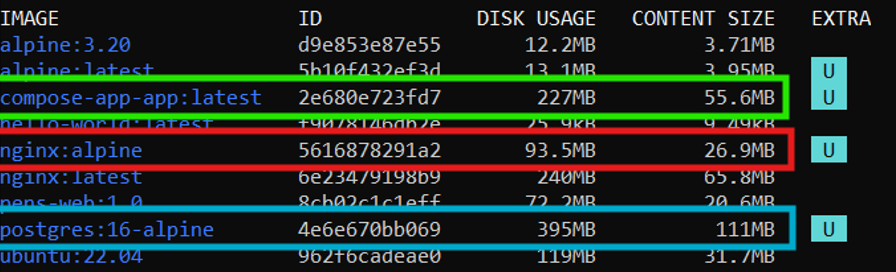
> - Terbesar: postgres:16-alpine (395 MB)
>   - Database engine lengkap (PostgreSQL)
>   - Berisi: query engine, storage engine, indexing dan replication tools
> - Flask app (compose-app-app) (227 MB)
>   - Base image: Python (python:3.11-slim)
>   - Tambahan: Flask dan psycopg2
>   - layer build dari Dockerfile
> - nginx:alpine (93.5 MB)
>   - Hanya web server
>   - tidak ada runtime besar
>   - minimal dependency