# Laporan Workshop Administrasi dan Jaringan
## Database PostgreSQL

 

  

 

| Disusun Oleh                     |            |
| -------------------------------- | ---------- |
| Rizal Maulana Airlangga          | 3124600033 |
| Muhammad Fajrul Fatih Abul 'Ilmi | 3124600040 |
| Nur Aini Agusthina               | 3124600050 |

| Kelas        | 2 S.Tr. Teknik Informatika B  |
| ------------ | ----------------------------- |
| **Kelompok** | **B4**                        |

 

### Dosen Pengampu
**Dr. Ferry Astika Saputra, S.T., M.Sc.**

 

## PROGRAM STUDI D4 TEKNIK INFORMATIKA
## DEPARTEMEN TEKNIK INFORMATIKA DAN KOMPUTER
## POLITEKNIK ELEKTRONIKA NEGERI SURABAYA
## 2026

  

# Pre-Lab
1. Apa fungsi file/folder /docker-entrypoint-initdb.d/ di image PostgreSQL?
> Folder tersebut digunakan untuk menjalankan script SQL atau shell otomatis saat PostgreSQL pertama kali dibuat.

2. Mengapa POSTGRES_PASSWORD wajib diset? Apa risikonya jika tidak ada password?
> Password wajib diset untuk keamanan akses database. Tanpa password, database rentan diakses pihak tidak berwenang.

3. Jelaskan perbedaan antara pg_dump format custom (-Fc) dan format SQL plain text.
> Format custom bersifat binary, mendukung kompresi dan restore selektif. SQL plain text menghasilkan file SQL biasa yang dapat dibaca manusia.

4. Apa itu shared_buffers dan mengapa perlu disesuaikan untuk container?
> shared_buffers adalah memory cache PostgreSQL untuk menyimpan data yang sering diakses. Nilainya perlu disesuaikan agar penggunaan RAM container tidak berlebihan.

5. Mengapa data PostgreSQL harus disimpan di Docker Volume, bukan di container layer?
> Karena container bersifat ephemeral. Jika container dihapus, data di layer container akan hilang, sedangkan volume bersifat persisten.

 

# Screenshot Wajib
## docker compose ps: db dan pgadmin Running + Healthy
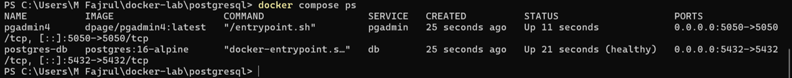

## psql connect + \dt app.*: List Tabel
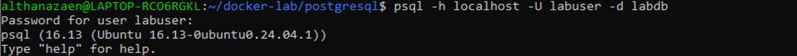  
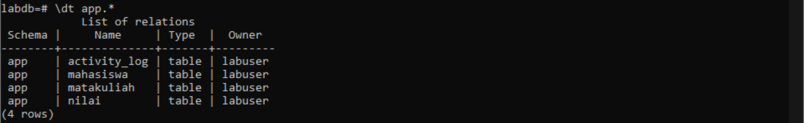

## SELECT * FROM app.mahasiswa: Data Sampel
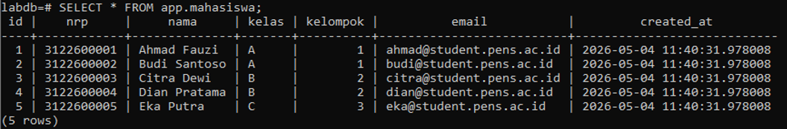

## Query JOIN nilai: Output Tabel Gabungan
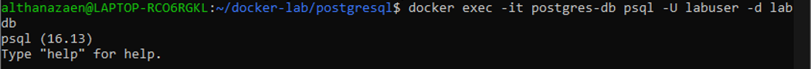  
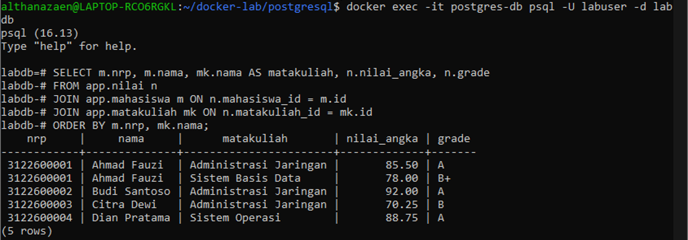

## pgAdmin4 Login + Server Connection

## pgAdmin4: Tabel View / Edit Data
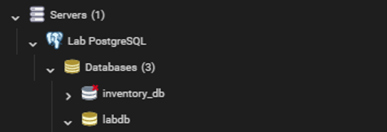

## pg_dump output: Backup File Terbuat
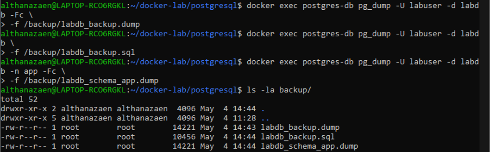

## pg_restore + SELECT: Data Berhasil di-restore
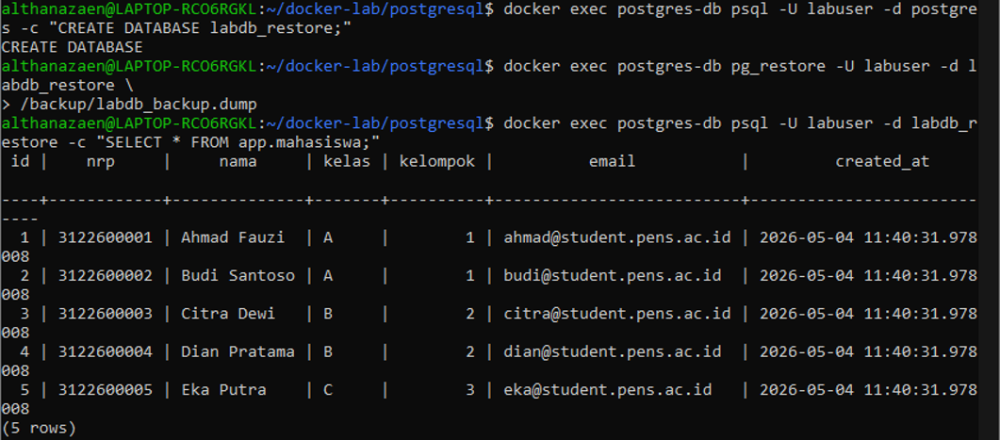

## pg_stat_activity: Koneksi Aktif
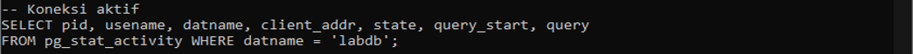

## PostgreSQL log: Isi Log File
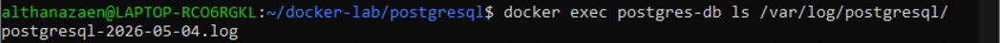  
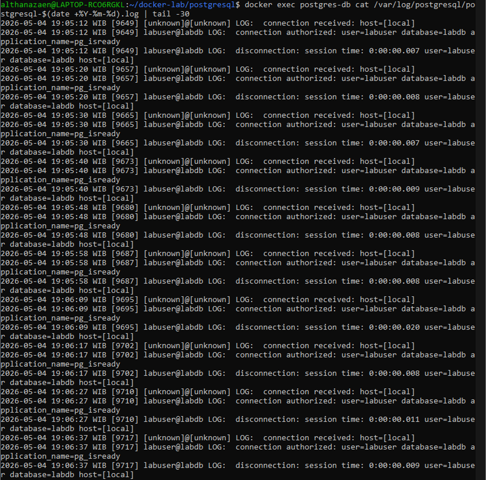

 

# Post-Lab
1. Jalankan docker compose down lalu docker compose up -d. Apakah data mahasiswa masih ada? Buktikan.
> **Data mahasiswa masih ada**. Perintah docker compose down secara default hanya menghapus container dan network, tetapi tidak menghapus Docker Volume yang didefinisikan di docker-compose.yml. Volume pg-data yang menyimpan data PostgreSQL (/var/lib/postgresql/data) tetap tersimpan di host. Langkah pembuktian:
> - Jalankan docker compose down
> - Jalankan docker compose up -d
> - Koneksi ke database dengan docker exec -it postgres-db psql -U labuser -d labdb
> - Jalankan query: SELECT * FROM app.mahasiswa;
> - Hasil: data mahasiswa (Ahmad Fauzi, Budi Santoso, Citra Dewi, dll.) masih ditampilkan lengkap
> Hal ini terjadi karena volume pg-data bertipe named volume yang managed oleh Docker dan persist di /var/lib/docker/volumes/pg-data/_data di host filesystem.

2. Jalankan docker compose down -v lalu docker compose up -d. Apa yang terjadi? Apakah init script dijalankan ulang?
> **Data akan hilang dan init script dijalankan ulang.**. Perintah docker compose down -v menghapus container, network, dan semua named volume yang didefinisikan di docker-compose.yml (termasuk pg-data, pg-logs, dan pgadmin-data). Ketika docker compose up -d dijalankan kembali:
> - Volume pg-data dibuat baru (kosong)
> - Container PostgreSQL mendeteksi bahwa data directory masih kosong
> - Entrypoint script menjalankan initdb untuk inisialisasi database baru
> - Semua file .sql dan .sh di /docker-entrypoint-initdb.d/ dieksekusi ulang
> - Schema app, tabel mahasiswa, matakuliah, nilai, activity_log dibuat kembali
> - Data sample di-insert kembali ke tabel  
> Init script dijalankan ulang karena kondisi inisialisasi (PGDATA kosong) terpenuhi. Ini merupakan perilaku yang diharapkan dan sangat berguna untuk environment development dan testing.

3. Bandingkan ukuran file backup format custom vs SQL. Mana yang lebih kecil dan mengapa?
>> **Format custom (-Fc) lebih kecil daripada format SQL plain text.**
> - Kompresi bawaan: Format custom menggunakan algoritma kompresi internal PostgreSQL yang mengkompresi data sebelum disimpan ke disk. Format SQL plain text tidak memiliki kompresi bawaan.
> - Format binary: Format custom menyimpan data dalam representasi binary yang lebih efisien daripada teks. Misalnya, integer disimpan sebagai 4 byte binary, bukan sebagai string karakter.
> - Tanpa statement SQL: Format SQL plain text berisi perintah SQL lengkap (CREATE TABLE, INSERT INTO, dll.) yang memerlukan banyak karakter teks. Format custom hanya menyimpan data mentah tanpa sintaks SQL.
> - Metadata terpisah: Format custom memisahkan metadata (schema definition) dari data, sehingga tidak ada redundansi. Format SQL mengulang informasi tipe data di setiap baris INSERT.

4. Buat query yang menampilkan mahasiswa yang belum memiliki nilai di semester apapun.
> SELECT m.id, m.nrp, m.nama, m.kelas, m.kelompok  
> FROM app.mahasiswa m  
> LEFT JOIN app.nilai n ON m.id = n.mahasiswa_id  
> WHERE n.mahasiswa_id IS NULL;

5. Jelaskan peran user app_reader yang dibuat di init script. Apa bedanya dengan labuser?
> | Aspek | labuser | app_reader |
> | --- | --- | --- |
> | Tipe user | Superuser / Owner database | Regular user dengan hak terbatas |
> | Dibuat oleh | Environment variable POSTGRES_USER | Init script (CREATE USER) |
> | Hak akses schema | Full access ke semua schema | Hanya USAGE pada schema app |
> | Hak akses tabel | Full CRUD (CREATE, READ, UPDATE, DELETE) | Hanya SELECT (read-only) |
> | Tujuan | Administrasi database, development, deployment | Aplikasi production yang hanya membaca data |
> | Keamanan | Berisiko tinggi jika credential bocor | Berisiko rendah (tidak bisa menghapus atau mengubah data) |