# Laporan Workshop Administrasi dan Jaringan
## Docker dan Instalasi

<br>

<div align="center">
  
</div>

<br>

| Disusun Oleh                     |            |
| -------------------------------- | ---------- |
| Rizal Maulana Airlangga          | 3124600033 |
| Muhammad Fajrul Fatih Abul 'Ilmi | 3124600040 |
| Nur Aini Agusthina               | 3124600050 |

| Kelas        | 2 S.Tr. Teknik Informatika B  |
| ------------ | ----------------------------- |
| **Kelompok** | **B4**                        |


<br>

### Dosen Pengampu
**Dr. Ferry Astika Saputra, S.T., M.Sc.**

<br>

## PROGRAM STUDI D4 TEKNIK INFORMATIKA
## DEPARTEMEN TEKNIK INFORMATIKA DAN KOMPUTER
## POLITEKNIK ELEKTRONIKA NEGERI SURABAYA
## 2026

<br><br>

# Pre-Lab
1. Mengapa centralized logging penting di lingkungan container?
> Centralized logging penting karena pada lingkungan container log dihasilkan oleh banyak container yang berjalan secara terpisah dan dapat dibuat atau dihapus secara dinamis (ephemeral). Jika log hanya disimpan di masing-masing container, proses debugging, monitoring, dan audit menjadi sulit dilakukan. Dengan centralized logging, seluruh log dikumpulkan ke satu lokasi sehingga administrator dapat mencari, menganalisis, dan memantau aktivitas sistem dengan lebih mudah. Selain itu, log tidak hilang ketika container dihapus atau dibuat ulang.

2. Apa perbedaan antara Docker logging driver json-file dan fluentd?
> | Aspek | json-file | fluentd |
> | --- | --- | --- |
> | **Fungsi** | Menyimpan log ke file JSON di host | Mengirim log ke Fluentd atau Fluent Bit |
> | **Lokasi log** | Lokal pada host Docker | Server/collector log terpusat |
> | **Default Docker** | Ya | Tidak |
> | **Centralized Logging** | Tidak | Ya |
> | **Analisis log** | Harus membaca file log | Dapat diteruskan ke database atau sistem monitoring |
>  
> Driver *json-file* cocok untuk penggunaan sederhana karena log disimpan dalam file JSON lokal. Sebaliknya, driver *fluentd* digunakan untuk centralized logging karena log langsung dikirim ke Fluent Bit atau Fluentd untuk diproses dan disimpan secara terpusat.

3. Jelaskan keuntungan menyimpan log di database (PostgreSQL) vs file text.
> - Mudah dicari menggunakan SQL, misalnya mencari log ERROR atau log dalam rentang waktu tertentu.
> - Mendukung indexing, sehingga pencarian lebih cepat dibanding membaca file satu per satu.
> - Dapat dianalisis dan dibuat statistik, seperti jumlah ERROR per jam atau distribusi log per container.
> - Mendukung JSONB, sehingga data log yang kompleks dapat disimpan dan di-query dengan mudah.
> - Lebih mudah diintegrasikan dengan dashboard dan aplikasi monitoring.
>  
> Sedangkan file text lebih sederhana tetapi sulit untuk pencarian, agregasi, dan analisis ketika jumlah log sangat besar.

4. Apa itu structured logging (JSON) dan mengapa lebih baik daripada plain text log?
> Structured logging adalah metode pencatatan log dalam format terstruktur, biasanya JSON, sehingga setiap informasi disimpan dalam pasangan key-value. Structured logging lebih baik karena:
> - Mudah diparsing oleh aplikasi dan sistem monitoring.
> - Setiap field dapat diakses secara langsung.
> - Mendukung filtering berdasarkan level, service, atau timestamp.
> - Cocok untuk penyimpanan JSONB di PostgreSQL.
> - Memudahkan analisis otomatis dan visualisasi data.
>  
> Plain text lebih mudah dibaca manusia, tetapi lebih sulit diproses secara otomatis.

5. Mengapa Fluent Bit lebih cocok untuk sidecar/edge collection dibanding Fluentd?
> Fluent Bit lebih cocok digunakan sebagai sidecar atau edge collector karena memiliki konsumsi resource yang sangat kecil dibanding Fluentd.
> Perbandingan:
> | Aspek | Fluent Bit | Fluentd |
> | --- | --- | --- |
> | **Bahasa** | C | Ruby + C |
> | **Memory** | ±1 MB | ±40 MB |
> | **Ukuran** | Ringan | Lebih besar |
> | **Use Case** | Edge collector, sidecar | Aggregator dan forwarder |
> | **Performa** | Sangat ringan | Lebih fleksibel tetapi lebih berat |

<br>

# Screenshot Wajib
## docker compose ps: 5 Service Running
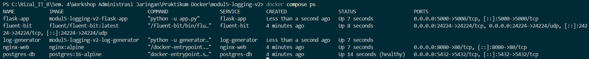

## docker compose logs fluent-bit: Fluent Bit Menerim Log (JSON lines di stdout)
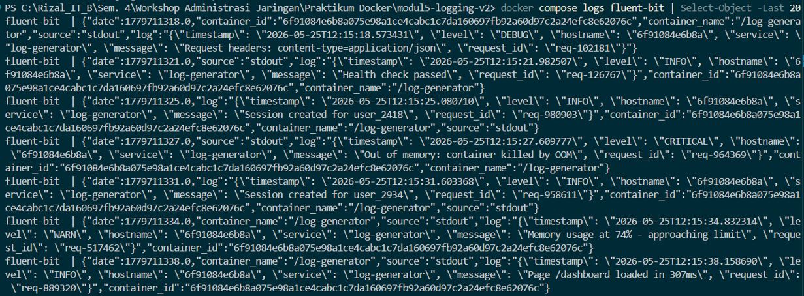

## SELECT COUNT(*) FROM logs.fluentbit: Jumlah Total log > 0
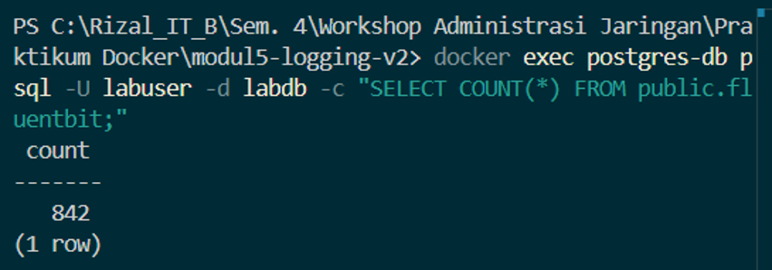

## SELECT tag, time, data FROM logs.fluentbit LIMIT 3: raw 3 Kolom Data
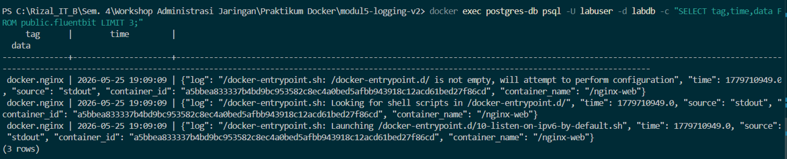

## SELECT * FROM logs.recent_logs LIMIT 10: Log Terbaru Via View
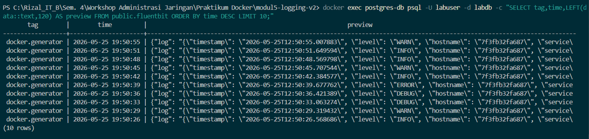

## SELECT * FROM logs.structured_logs LIMIT 10: Parsed JSON Log
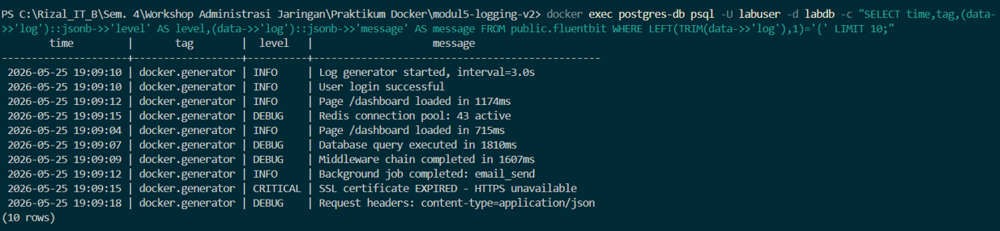

## Query distribusi per tag: Output Tabel
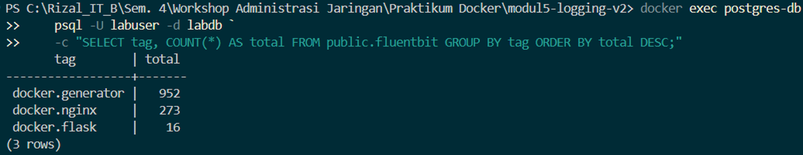

## Query distribusi per level: Output Tabel
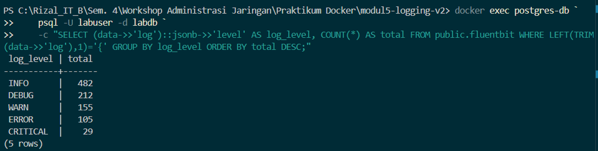

## SELECT * FROM logs.error_summary: Summary Error
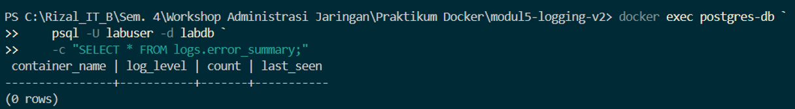

## Query log rate per menit: Output Tabel
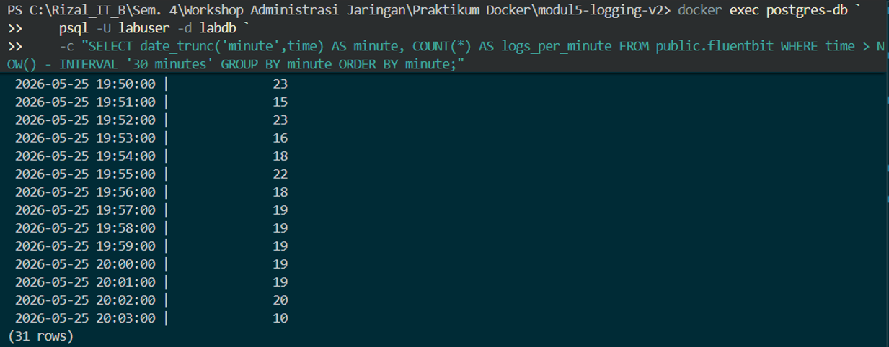

## curl /api/logs/stats: Response JSON
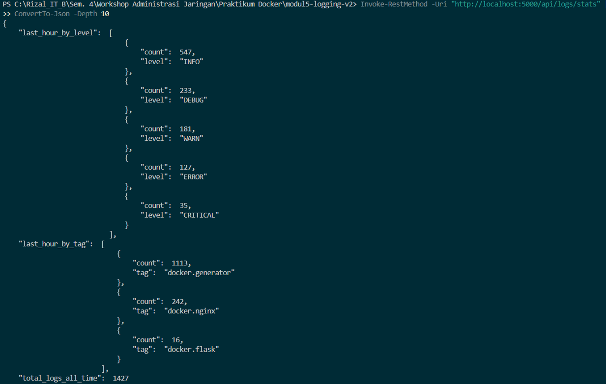

## curl /api/logs/search?q=error: Response JSON
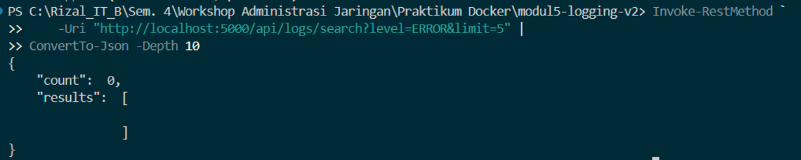

<br>

# Post-Lab

1. Berapa total log yang masuk ke PostgreSQL setelah 5 menit? Tunjukkan distribusi per tag dan per level.
> 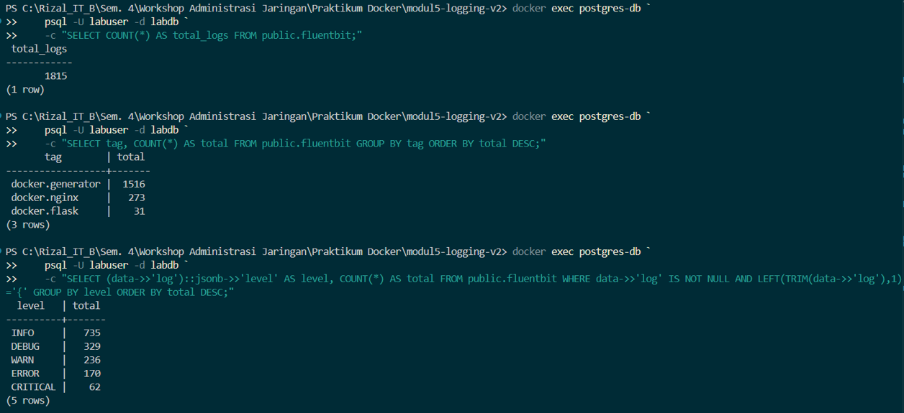

2. Tulis query SQL yang menampilkan log rate per menit selama 10 menit terakhir. Tunjukkan hasilnya.
> **Query SQL:**
> ```sql
> SELECT
>   date_trunc('minute', time) AS minute,
>   COUNT(*) AS logs_per_minute
> FROM public.fluentbit
> WHERE time > NOW() - INTERVAL '10 minutes'
> GROUP BY minute
> ORDER BY minute;
> ```
> Output Hasil Query:  
> 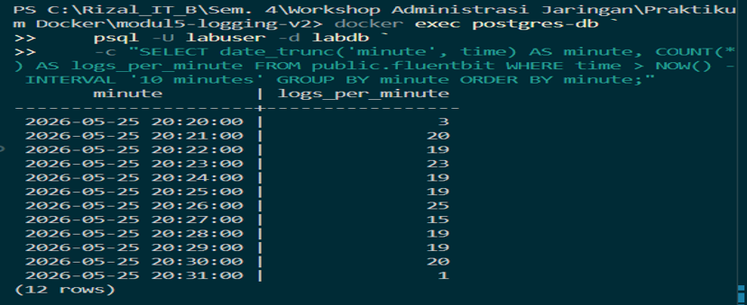

3. Apa yang terjadi jika container fluent-bit di-stop? Apakah container lain juga stop? Apakah log yang dihasilkan selama Fluent Bit down hilang?
> 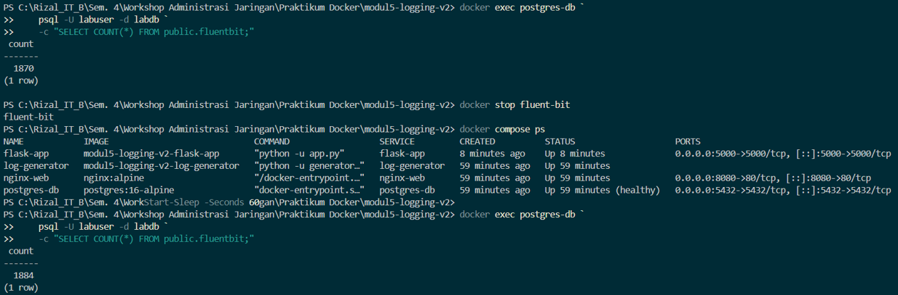
> Log tetap konstan dan berhenti bertambah pada database selama Fluent Bit dimatikan, sehingga disimpulkan bahwa log tidak masuk selama Fluent Bit mati. Container lainnya tetap berjalan secara independen meskipun penampung log utama berhenti.

4. Jelaskan alur sebuah log entry dari log-generator stdout sampai bisa di-query di PostgreSQL. Sebutkan setiap komponen yang dilalui.
> ```text
> log-generator
> │
> ▼
> stdout
> │
> ▼
> Docker Fluentd Logging Driver
> │
> ▼
> Fluent Bit (Forward Input)
> │
> ▼
> Fluent Bit PostgreSQL Output
> │
> ▼
> PostgreSQL (public.fluentbit)
> │
> ▼
> Flask API / Query SQL
> ```
> Komponen mendasar yang dilalui:
> 1. Log Generator
> 2. stdout
> 3. Docker Fluentd Driver
> 4. Fluent Bit
> 5. PostgreSQL
> 6. Flask API atau SQL Client

5. Jelaskan perbedaan antara log Nginx (plain text) dan log generator (structured JSON) saat tersimpan di kolom data JSONB. Mengapa view structured_logs hanya menampilkan log JSON?
> **Kesimpulan:**
> 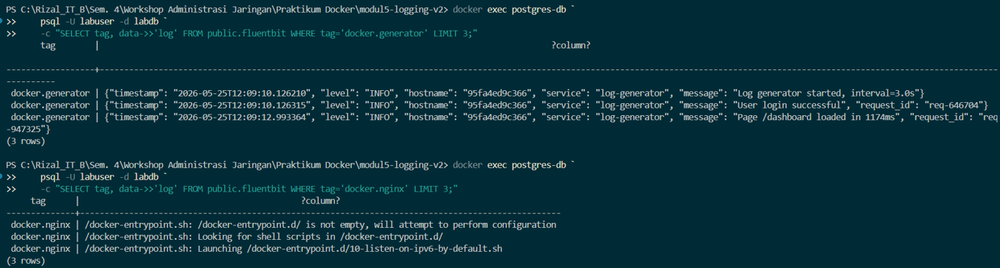
> - **Log Generator:** Menghasilkan data dalam bentuk *structured JSON*, sehingga secara otomatis dapat diekstrak langsung menjadi field terpisah seperti level, message, service, dan hostname.
> - **Log Nginx:** Hanya menghasilkan output *plain text* mentah sehingga tidak memiliki struktur objek JSON default pada database.
> - **View structured_logs:** Hanya menampilkan entri berbasis JSON murni karena query internal pada view tersebut melakukan pemrosesan selektif parsing JSON (`data->>'log'`) yang mengharuskan format string valid berupa objek key-value.