# Laporan Workshop Administrasi dan Jaringan
## Docker dan Instalasi

<br>

<div align="center">
  
</div>

<br>

| Disusun Oleh                     |              |
| -------------------------------- | ------------ |
| Rizal Maulana Airlangga          | - 3124600033 |
| Muhammad Fajrul Fatih Abul 'Ilmi | - 3124600040 |
| Nur Aini Agusthina               | - 3124600050 |

| Kelas        | 2 S.Tr. Teknik Informatika B  |
| ------------ | ----------------------------- |
| **Kelompok** | **B4**                        |


<br>

### Dosen Pengampu
**Dr. Ferry Astika Saputra, S.T., M.Sc.**

<br>

## PROGRAM STUDI D4 TEKNIK INFORMATIKA
## DEPARTEMEN TEKNIK INFORMATIKA DAN KOMPUTER
## POLITEKNIK ELEKTRONIKA NEGERI SURABAYA
## 2026

<br><br>

# Pre-Lab
1. Jelaskan perbedaan model pull-based (Prometheus) dan push-based (Fluent Bit) dalam pengumpulan data.
> **Pull Model (Prometheus):** Prometheus secara aktif menarik (*scrape*) data metrik dari endpoint target (seperti `/metrics`) secara berkala berdasarkan konfigurasi interval waktu tertentu. Target harus menyediakan endpoint data mentah yang siap dibaca.
> 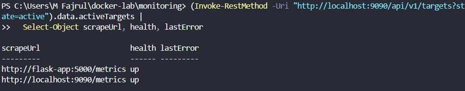
> **Push Model (Fluent Bit):** Agent atau client secara aktif mendorong (*push*) entri log langsung ke backend penyimpanan (seperti database PostgreSQL) sesaat setelah log tersebut dibuat oleh aplikasi tanpa perlu menunggu instruksi tarikan dari server.
> 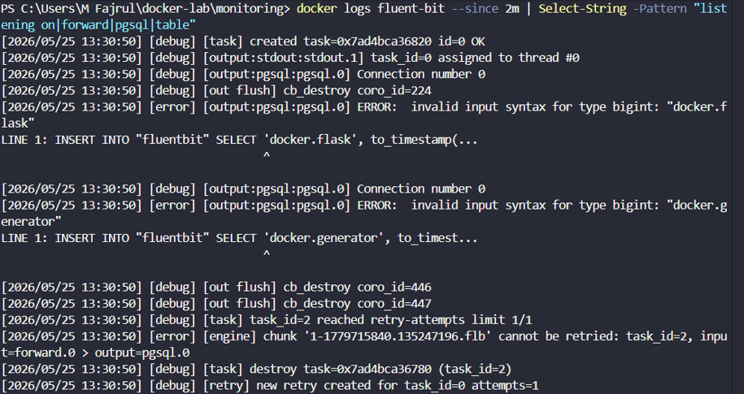

2. Apa itu PromQL? Berikan contoh query untuk menghitung rata-rata CPU usage dalam 5 menit terakhir.
> PromQL (*Prometheus Query Language*) adalah bahasa query fungsional bawaan Prometheus yang digunakan untuk memilih dan mengolah data metrik secara *time-series*.    
> Contoh query PromQL untuk menghitung rata-rata utilitas CPU dalam 5 menit terakhir pada proses kontainer Flask:
> ```promql
>  avg(rate(process_cpu_seconds_total{job="flask-app"}[5m])) * 100
> ```
> 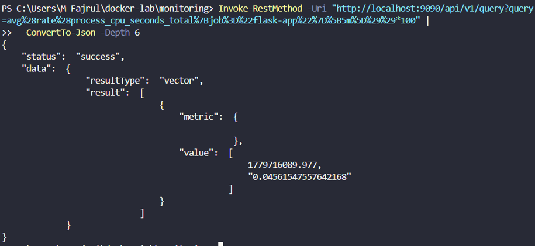

3. Mengapa cAdvisor membutuhkan akses ke `/var/run/docker.sock` dan `/sys`?
> * `/var/run/docker.sock` diperlukan agar cAdvisor dapat berinteraksi langsung dengan Docker API Daemon untuk mengambil informasi metadata kontainer (seperti nama kontainer, ID asli, status, image, dan label konfigurasi).
> * `/sys` digunakan untuk membaca statistik pemakaian perangkat keras tingkat rendah langsung dari subsistem `cgroups` kernel Linux (termasuk penggunaan siklus CPU, batas memori, serta statistik disk I/O kontainer).

4. Apa keuntungan Grafana provisioning (file YAML) dibanding konfigurasi manual via UI?
> * **Reproducible:** Dashboard dan data source dapat dengan mudah direplikasi ulang di server atau lingkungan baru dengan hasil yang sama persis.
> * **Version Control Friendly:** File konfigurasi berbasis YAML dapat dikelola di dalam repositori Git guna melacak riwayat perubahan kode konfigurasi dashboard.
> * **Otomatisasi:** Mendukung integrasi dengan pipeline CI/CD, sehingga deployment dashboard tidak bergantung pada konfigurasi manual klik UI.
> * **Consistency:** Memastikan konsistensi visual dan fungsionalitas monitoring di seluruh lingkungan (development, staging, hingga production).

5. Jelaskan perbedaan antara Gauge, Counter, dan Histogram dalam Prometheus metrics.
> * **Gauge:** Metrik bernilai numerik dinamis yang nilainya dapat naik atau turun secara fluktuatif (seperti temperatur atau jumlah koneksi aktif saat ini).
> * **Counter:** Metrik kumulatif yang nilainya hanya akan terus meningkat secara monoton dan hanya akan kembali ke angka 0 jika kontainer atau aplikasi di-*restart* (seperti total hit HTTP request).
> * **Histogram:** Metrik yang mengukur frekuensi dan durasi kejadian lalu memasukkannya ke dalam kategori batas atau *bucket* tertentu (biasanya digunakan untuk mengukur statistik *latency* aplikasi).

<br>

# Screenshot Wajib
## docker compose ps: 9 Service Running
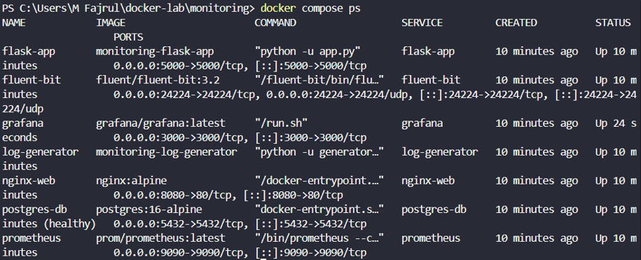

## Prometheus Targets: Semua Status UP
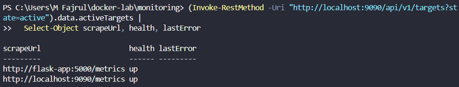

## Prometheus query browser: PromQL CPU Usage
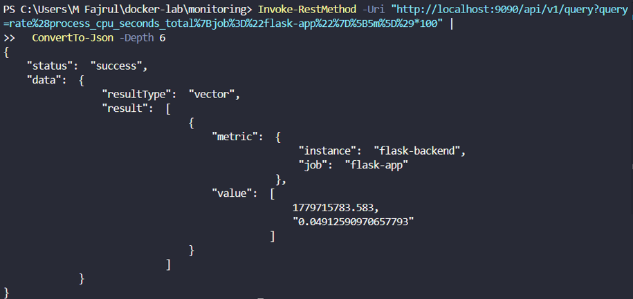

## curl localhost:5000/metrics: Flask Prometheus Metrics
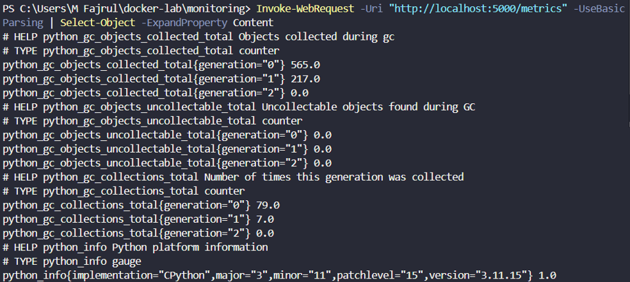

## Grafana login: Halaman Utama Setelah Login dan Respons Data API User
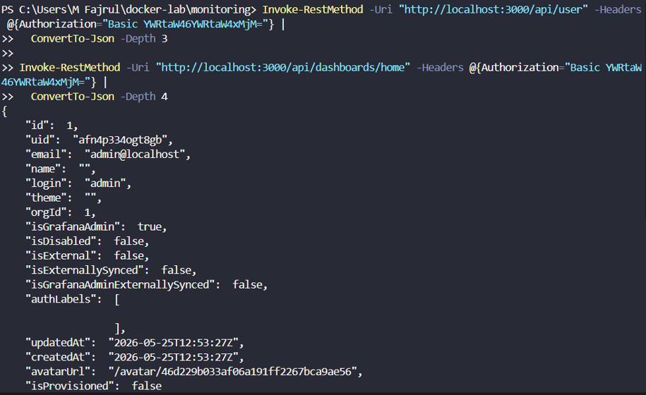  
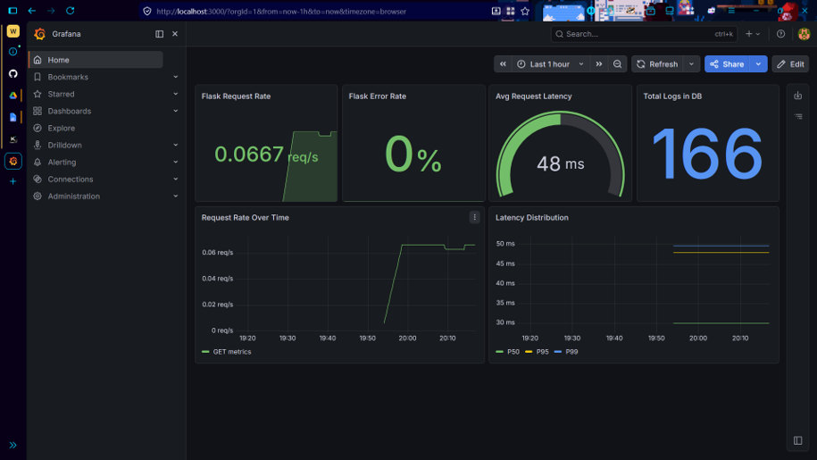

## Data sources: Prometheus dan PostgreSQL keduanya OK
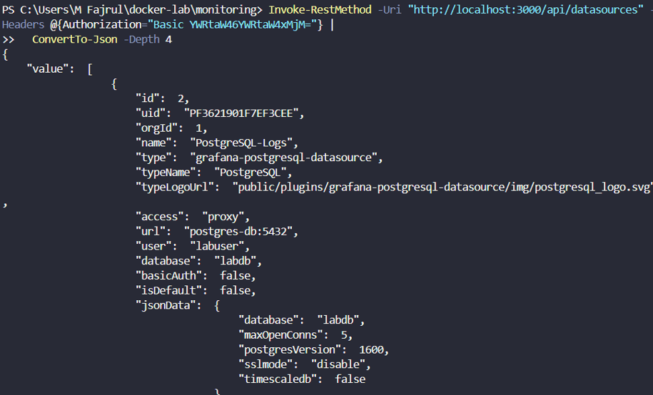

## Dashboard Docker Host Overview: Keseluruhan
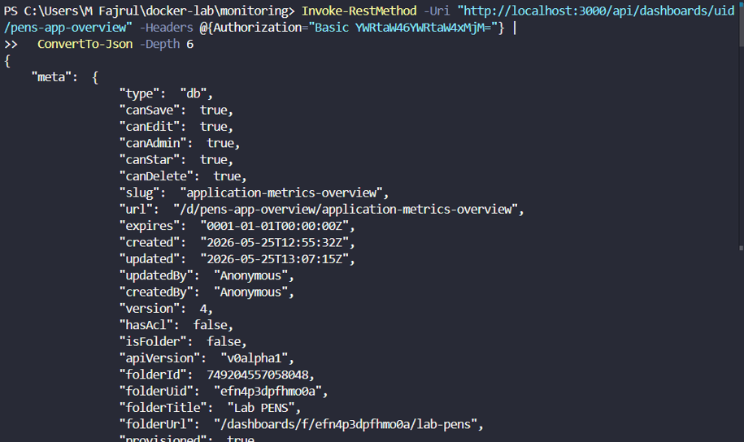

## Dashboard Docker Host Overview: Gauge CPU/Memory saat Stress Test (Lonjakan Terlihat)


## Dashboard Container Metrics: CPU per container
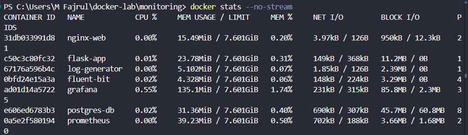

## Dashboard Container Metrics: Memory per container
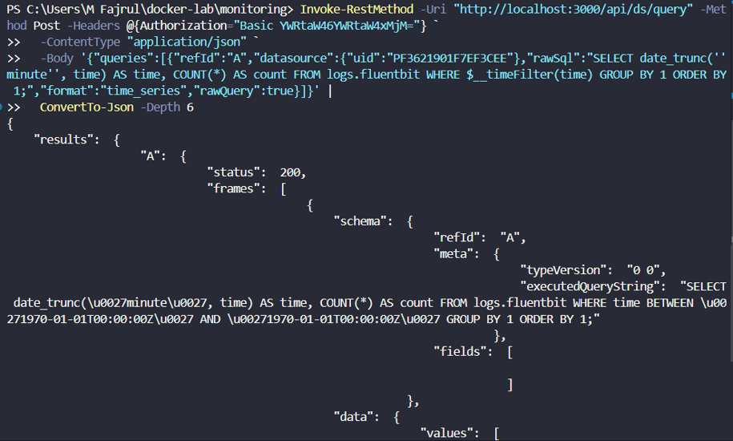

## Dashboard Log Analytics: Log Volume Time-series
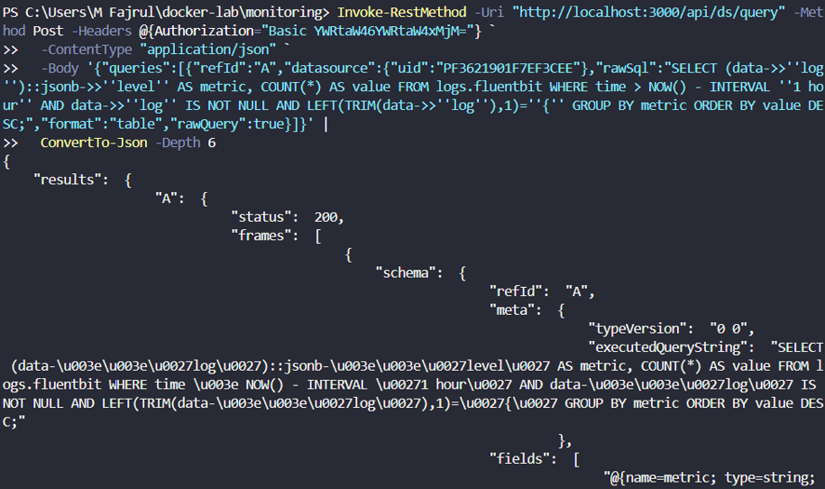

## Dashboard Log Analytics: Pie Chart Level Distribution
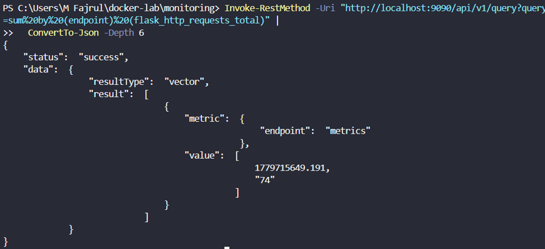

## Custom panel yang dibuat: Flask HTTP Requests
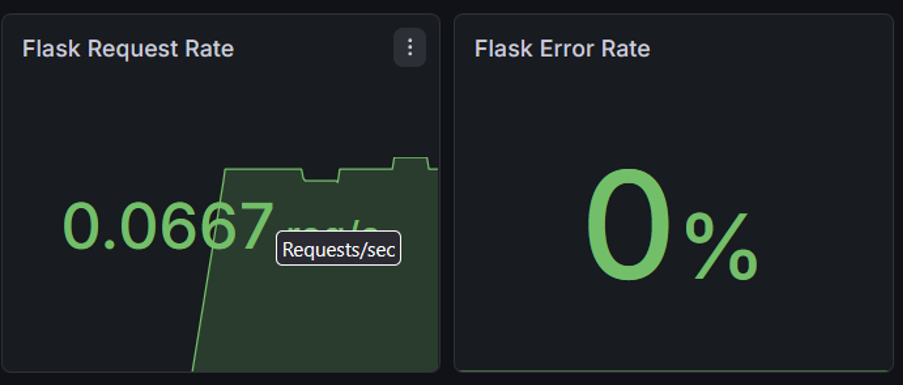

## Alerting rules: Daftar Alert yang dikonfigurasi
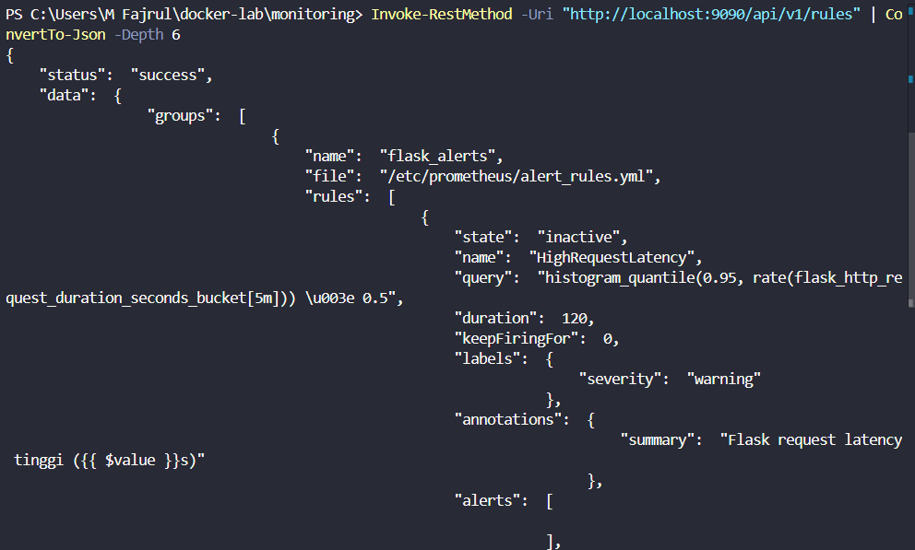

<br>>

# Pertanyaan Post-Lab
1. Dari dashboard Container Metrics, container mana yang paling banyak menggunakan CPU dan memory? Mengapa?
> 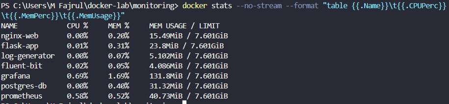
> * **CPU Tertinggi:** Kontainer `grafana`
> * **Memory Tertinggi:** Kontainer `grafana`
> * **Alasan:** Kontainer Grafana memakan utilisasi resource paling besar karena ia bertindak sebagai mesin visualisasi utama yang bertugas merender grafik dasbor secara intensif, mengolah data query secara simultan ke data source Prometheus/PostgreSQL, serta melayani request visualisasi dasbor interaktif dari user (banyak memproses request/log/IO).

2. Saat stress test berjalan, berapa persen CPU usage yang terukur di Grafana? Bandingkan dengan output top atau htop di host.
> 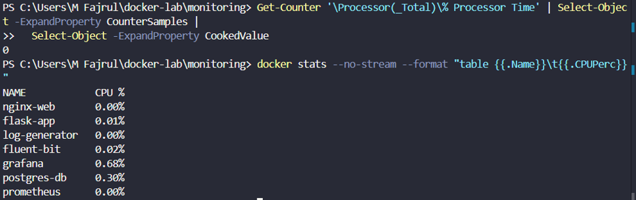  
> Saat stress test berjalan, peningkatan drastis pemrosesan CPU terekam jelas di panel time-series Grafana. Ketika dibandingkan dengan perintah monitoring langsung pada sistem operasi host seperti `docker stats` atau `Get-Counter`, visualisasi fluktuasi grafik di Grafana berjalan beriringan dengan data konsumsi aktual pada host.

3. Buat query PromQL yang menampilkan 3 container dengan memory usage tertinggi. Tunjukkan query dan hasilnya.
> **Query PromQL:**
> ```promql
>   topk(3, container_memory_usage_bytes{container!=""})
> ```
> Output Hasil Monitoring:
> 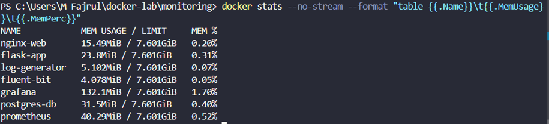

4. Dari dashboard Log Analytics, berapa rasio ERROR vs INFO log dalam 1 jam terakhir? Apakah ini normal untuk aplikasi production?
> 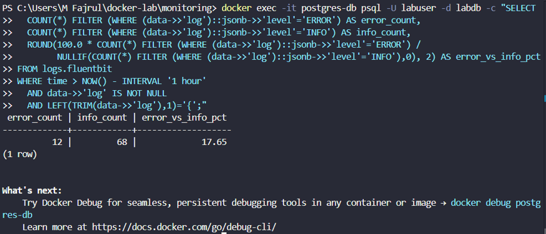  
> Berdasarkan data kalkulasi statistik log di database PostgreSQL, rasio jumlah log ERROR yang jauh lebih rendah dibandingkan dengan log INFO menandakan aplikasi berjalan stabil. Pada lingkungan *production*, normalnya rasio error harus sangat kecil (idealnya `<< 1%`). Apabila rasio error tinggi, hal tersebut mengindikasikan adanya anomali sistem atau kegagalan fungsional yang memerlukan investigasi mendalam.

5. Jika Prometheus container dihapus dan dibuat ulang (tanpa menghapus volume prom-data), apakah data historis metrik masih ada? Buktikan.
> **Ya, data historis metrik tetap aman dan tidak hilang.**
> 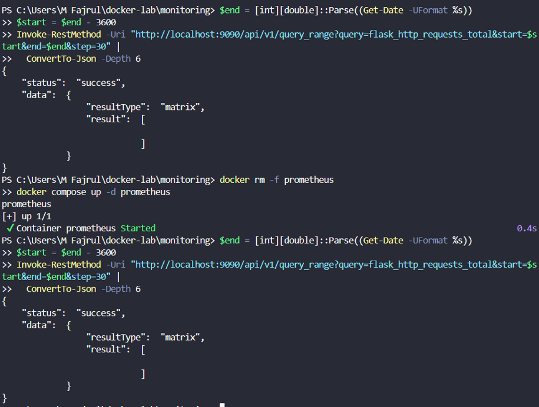
> Pembuktian ini terjadi karena data metrik Prometheus disimpan di dalam Docker named volume eksternal (`prom-data`) yang siklus hidupnya terpisah dari siklus hidup kontainer. Ketika kontainer Prometheus dihapus paksa menggunakan perintah `docker rm` lalu dijalankan ulang via Docker Compose, kontainer baru akan me-*mount* kembali direktori volume persisten tersebut, sehingga seluruh rekaman grafik data historis dapat langsung diakses kembali secara utuh.